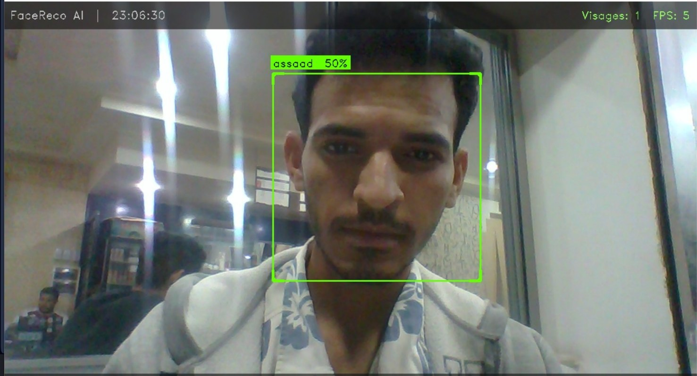
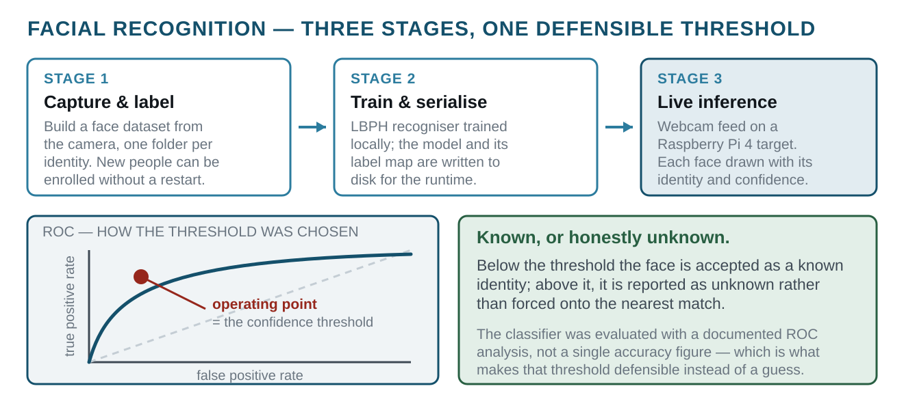

# Real-Time Facial Recognition System
> OpenCV pipeline from dataset capture to live webcam recognition, with a documented ROC evaluation.
`2025` · `Python` · `OpenCV` · `LBPH` · `Raspberry Pi 4` · `Computer vision`



## About

A three-stage recognition pipeline built for a Raspberry Pi 4 target. Stage one captures and labels a face dataset from the camera; stage two trains a local recogniser and serialises the model and label map; stage three runs live inference on the webcam feed, drawing each detected face with its predicted identity and confidence score.

Recognition uses a confidence threshold — below it the face is accepted as a known identity, above it it is reported as unknown — and each label is drawn in its own colour. The application supports enrolling a new person without restarting and capturing annotated screenshots for evidence.

The classifier was evaluated with a documented ROC analysis rather than a single accuracy figure, which is what makes the confidence threshold a defensible choice instead of a guess.

## Figures



## Contents

```
README.md
RECO.pdf
Untitled.ipynb
docs/
face__roc.docx
face__roc.pdf
face_dataset.py
face_recognition_app.py
face_train.py
raspberry-pi-4.png
```

## Notes

The training DATASET is deliberately excluded: it is photographs of real people and does not belong in a public repository. `face_dataset.py` rebuilds it from a webcam.

Not included in this repository: 2 belongs to another project file(s), 2 duplicate copy file(s), 3 excluded by name file(s) - build caches, generated toolpaths and oversized binaries are kept out on purpose. The source they are generated from is here.

## Documents

- [`docs/Reconnaissance_Faciale_RPi.pptx`](docs/Reconnaissance_Faciale_RPi.pptx): defence slides (FR), ENIG GEA 2, 2025-2026, supervised by M. Mohamed Naoui. They cover the architecture, the LBPH parameters (radius 1, 8 neighbours, 8x8 grid, confidence threshold 70) and the test conditions (3 subjects, 50 images each).

## Third-party work used here

Everything in this repository is my own work. It builds on the following, which are **not** mine and are used under their own licences:

- **OpenCV (LBPH face recogniser, Haar cascades)** by OpenCV team — <https://opencv.org>

## Author

Lassaad Mahmoudi — <assaadmahmoudi0@gmail.com>  
https://linkedin.com/in/mahmoudi-assaad
